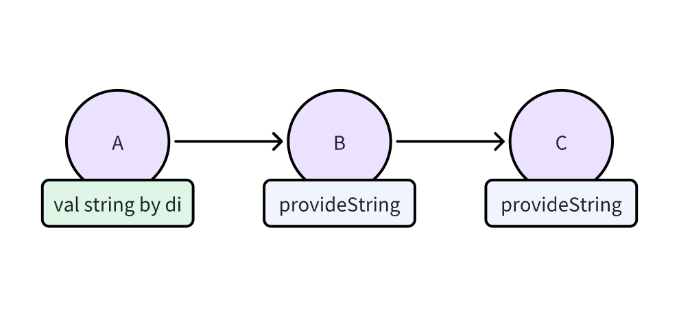
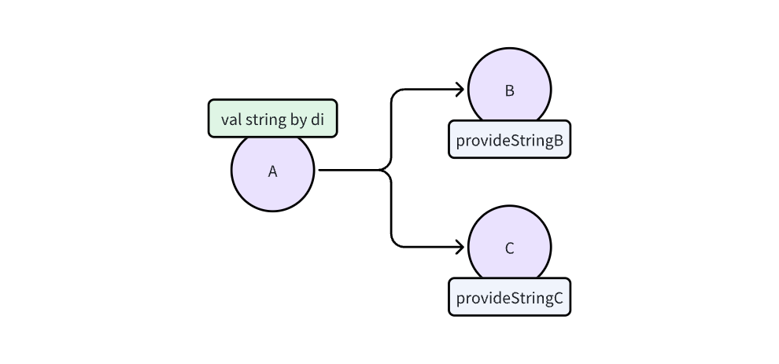
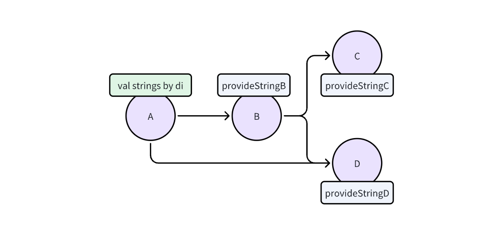

# Principles of Knit Dependency Lookup

### 1. Shortest path

`B` is a composite component of `A`, `C` is a composite component of `B`, and they build a dependency chain.

When `A` wants to inject a string, it will prefer to use `B`'s instead of `C`'s.

Therefore, the principle of shortest path is: once dependency is found, it will stop and will not continue to traverse
upwards.

### 2. Priority principle

Dependency lookup in the following order:

- provided by itself
- provided through inheritance relationships
- obtained through composition relationships
- providers defined in the global
- perform Multi-binding analysis on types such as List and Set

You can directly look at the code for more details. The priority-related code is defined in `Injection` which can be
found directly in [Injection source code](../knit-asm/src/main/java/tiktok/knit/plugin/injection/InjectionBinder.kt).

### 3. Dependency conflict

After the analysis is completed according to the priority principle, conflict detection is performed.

At this time, if there are multiple dependency providers for the same type, type conflicts error will be thrown (except
for the Multi-binding) at the compile stage.

### 4. Possible duplicates in `@IntoList`

The best use case is to use it in a constructor and then provide it as an interface. With various combinations of
components, you may get multiple duplicate results due to the potential for duplicate combinations

For example, `A` combines the capabilities of `B` and `D`, but in the `strings` list might result in something like
this:

`[stringB, stringC, stringD, stringD]`

`D` is supplied twice because there are two `stringD`'s on the full dependency chain of `A`

> Or you can use `IntoSet` directly, but logically, there will be more complex data structures behind `Set` (memory
> consumption is increased a little).